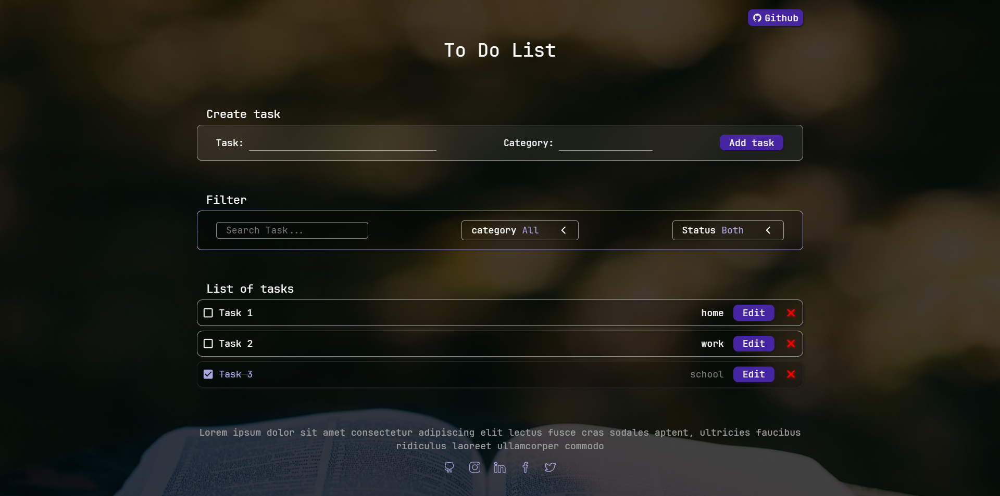

# To-Do

The To-Do allows us to show all the tasks or activities that we want to perform.

## ⚙️ Function of the website

- Create task is where we can write down the task and add a category to it.
- The filter is where we can indicate one of three ways to find one or more tasks.
  1. Search text.
  2. Categories assigned.
  3. Task status.
- Task list is where the created tasks will be displayed and where we can edit the task, change its status or delete the task.

## 🚀 Technologies and tools used

- [ReactJS](https://es.react.dev/)
- [TypeScript](https://www.typescriptlang.org/)
- [Vite](https://vitejs.dev/)

### Dependencies

- [sass](https://sass-lang.com/)
- [React-icons](https://www.npmjs.com/package/react-icons)

## 📊 Project status

| Status         | Start date | End date   |
| -------------- | ---------- | ---------- |
| ⌛ In progress | 2024-09-23 | 2024-10-04 |

## 🌐 [Website](https://bryangrandon.github.io/To-Do/)

